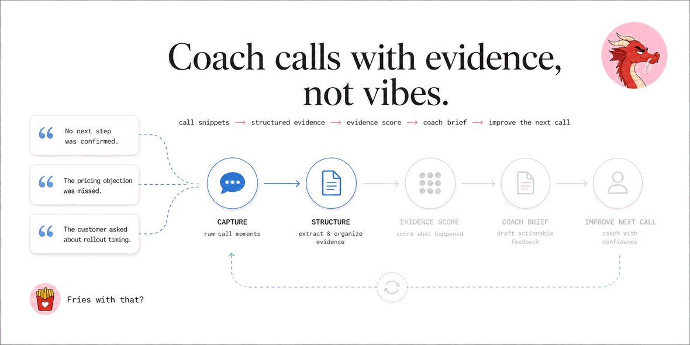
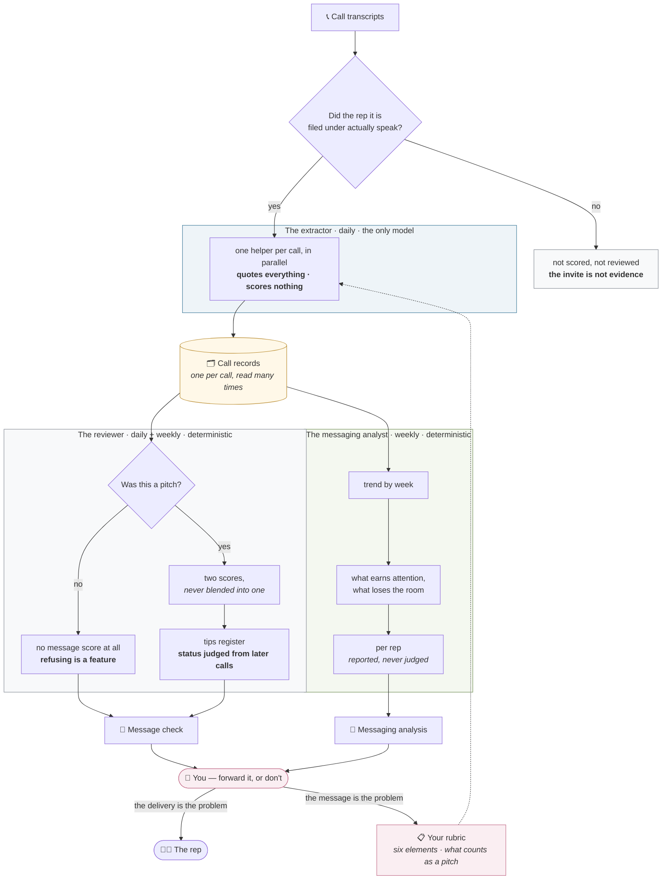
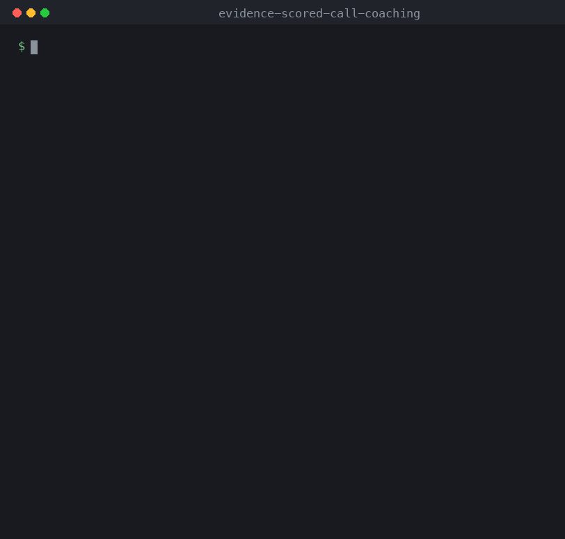
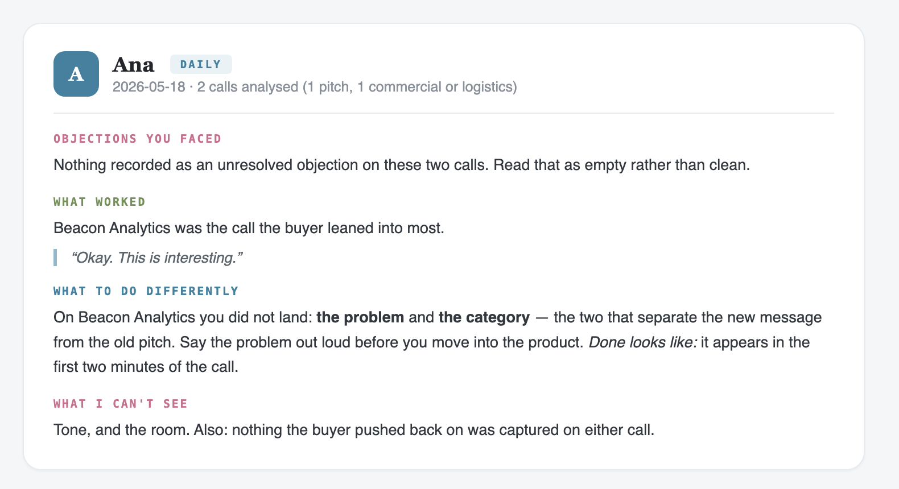
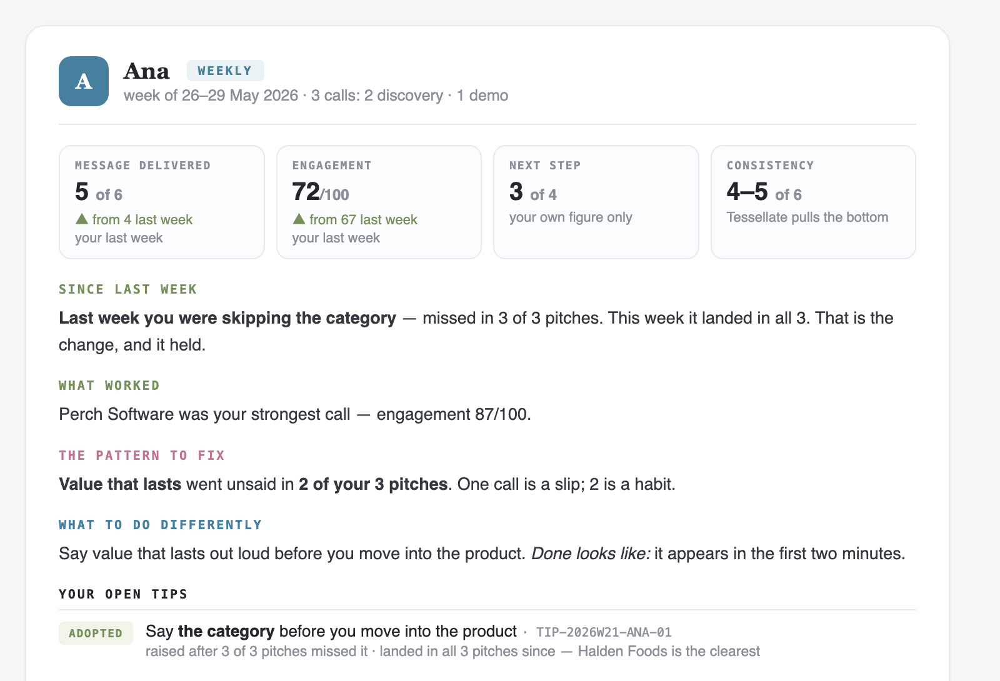
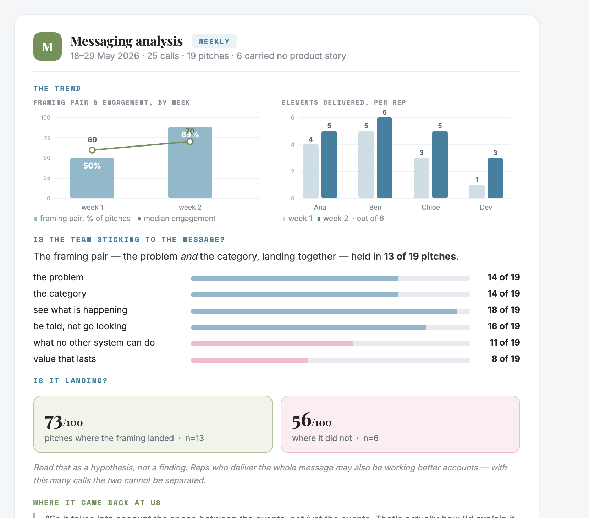
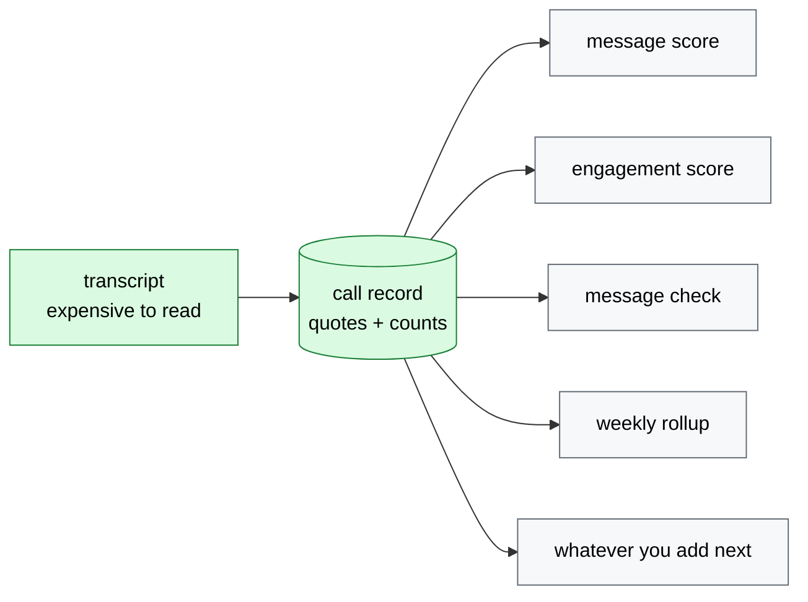

# Evidence-scored call review

  

*The per-rep artifact is a **message check**, not coaching — it read a transcript, it wasn't in the room ([Decision 13](DECISIONS.md)).*

> A template for **grading conversations against a rubric you can defend**: read each transcript once, score it only where the rubric applies, require a verbatim quote for every point given *or withheld*, and refuse to state a verdict until there are enough calls to justify one.



The example in this repo is a sales team checking whether reps actually deliver a new positioning message. The pattern works anywhere a human judgment becomes a number someone is measured on — support-ticket QA, interview scorecards, teaching observations, compliance call review. The failure modes are the same everywhere: scoring things the rubric was never meant to cover, awarding points with no evidence, and calling a trend off four data points.

---

## What it does

Point it at a folder of call transcripts. It gives you, per call:

| | |
|---|---|
| **How much of your message was delivered** | six things you decided to say, counted — and only on calls where a pitch belonged |
| **How the buyer responded** | next step reached, situations they described, excitement, real back-and-forth — *minus* hedges, deferrals and unresolved objections, counted double when they land late |
| **A delivery receipt per run** | what it *actually sent*, not what it wrote — because a green run with an empty inbox looks identical from outside ([Decision 15](DECISIONS.md)) |
| **A message check per rep** | the objections they faced, what landed, one thing to change, and what the system couldn't see — every claim quoting the call. **No scores and no comparison to anyone**; numbers appear weekly, beside that rep's own previous week. Deliberately not called coaching: it read a transcript, it wasn't in the room |

---

## The agents

| | Runs | Model | Purpose | Reads | Produces |
|:--|:--|:--|:--|:--|:--|
| **The extractor** *(one per call, in parallel)* | inside each daily run | **Sonnet-class.** Claude Sonnet 5 (API or a Claude Code subscription), Codex CLI, or Llama 3.1 8B / Qwen 2.5 via Ollama if you want it free and offline. A reasoning model is wasted here — the judgement lives in the rubric, not the model. | Read one call and come back with facts. Every verdict carries the sentence that proves it, including the ones that say an element was missing. | exactly one transcript | one **call record** — it decides nothing and scores nothing |
| **The reviewer** | daily **and** weekly | **none.** Python | Show each rep what their calls did. Daily: *you skipped it on this call*. Weekly: *you skip it* — plus the trend, the spread, and whether the last tip stuck. | call records for that window, and the tips register | a **message check** per rep, and the updated **tips register** |
| **The messaging analyst** | weekly | **none.** Python | Ask whether the message itself is working, separately from who delivered it. Reports per rep, but never judges one. | every call record, all weeks | the **messaging analysis** — trend, what earns attention, what loses the room |
| **You** | 2 min daily · 10 min weekly | — | Decide. Forward the message check, or don't. Rewrite the rubric when the analysis says the message is the problem rather than the delivery. | the message check and the analysis | **edits to `rubric/`** — the only file that changes what any of this measures |

Only the extractor is a model, and only because reading unstructured speech is the one thing a model does that code cannot. *What* to say is chosen by rules: the same evidence always produces the same message check, and a rep asking "why this one?" gets an answer rather than a shrug. In the system this came from, the reviewer and the analyst are LLM agents — see [Decision 9](DECISIONS.md) for why they are not here, and `callscore/extractors/base.py` for the seam if you disagree.



The two dotted-in boxes are the only ones you touch: the **rubric** going in, and **you** coming out. Everything between them is fixed — which is the point. When the analysis says every rep misses the same element, that is not four delivery problems, it is one rubric that is asking for something the pitch has no room to say.

---

## Quickstart

No install, no API key, no network:

```bash
git clone https://github.com/barbararomeira/evidence-scored-call-review
cd evidence-scored-call-review
python3 run_day.py --mock
```



Above: one day, then the whole week. On three calls the daily run prints its numbers and refuses the verdict; on nineteen pitches the weekly one concludes. Same rule, different sample.

The full run scores **25 calls** — two of the 27 fixtures never reach the scorer at all, one filed under a rep who never speaks on it and one whose transcript came back as a single speaker block. Both are printed with their reason rather than dropped quietly. Here are the first six:

| call | rep | type | message delivered | framing pair | engagement | echo |
|:--|:--|:--|:-:|:-:|:-:|:-:|
| c-0412 | Ana | discovery | **4** of 6 | ✗ | 67 / 100 | — |
| c-0413 | Ana | pricing | *not a pitch* | — | 67 / 100 | — |
| c-0414 | Ben | demo | **6** of 6 | ✓ | 93 / 100 | ✓ |
| c-0415 | Ben | scheduling | *not a pitch* | — | 26 / 100 | — |
| c-0416 | Chloe | intro | **1** of 6 | ✗ | 35 / 100 | — |
| c-0417 | Chloe | discovery | **4** of 6 | ✓ | 60 / 100 | — |

*Message delivered* counts how many of your six message elements the rep actually said, out of the number that call had room for. *Framing pair* is whether the two that matter most — the problem and the category — landed **together**. *Engagement* is what the buyer did, scored out of 100.

> **Scored for message:** 4 of 6 calls — `c-0413` and `c-0415` were never pitches
> **Framing pair landed:** 2 of 4 pitches · `n=4 — not enough data yet`
> **Echo:** 1 of 6, recorded and never scored
> **Every scored point carries a verbatim quote found in its own transcript.**

Three things in that table are the whole design:

1. **Two calls have no score at all**, not a zero. A pricing negotiation isn't a bad pitch — it isn't a pitch.
2. **One number refuses to be interpreted.** It prints, then says the sample is too small to mean anything.
3. **Ana looks fine and isn't.** Four of six elements delivered, twice — but the framing pair never lands. A coverage score alone calls that a good week.

### The three things it writes

**① The daily message check** — what one rep gets the morning after their calls:



**② The weekly message check** — same shape, but carrying the four things a day structurally cannot: a trend against the rep's *own* previous week, consistency (the spread across their pitches and which call pulls the bottom), follow-through on the last tip, and the open tips register with a status derived from later calls — never self-reported:



**③ Messaging analysis** — a different document for a different reader. About the message, never about a person:



All five outputs are committed as text in **[`examples/`](examples/)**; the cards above are rendered from the same run by [`docs/make_visuals.py`](docs/make_visuals.py), so they cannot drift from what the code does.

`--mock` swaps **only** the extraction step, replaying pre-recorded call records from `fixtures/`. Every gate, score, selection and rollup after that is real code executing. Want to read before running? [`examples/`](examples/) has the committed output.

---

## Finding your way around

| If you want to… | Go here |
|---|---|
| see what it produces, without cloning | [`examples/`](examples/) |
| change what gets scored | [`rubric/`](rubric/) — four files, the only ones you edit |
| understand why it works this way | [`DECISIONS.md`](DECISIONS.md) — 10 entries, chose / considered / why |
| see the calls it runs on | [`fixtures/`](fixtures/) — invented transcripts and the story they tell |
| plug in your own model | [`callscore/extractors/base.py`](callscore/extractors/base.py) — one method |
| read the scoring itself | [`callscore/score_message.py`](callscore/score_message.py) · [`score_engagement.py`](callscore/score_engagement.py) · [`scope.py`](callscore/scope.py) · [`attribution.py`](callscore/attribution.py) |

---

## What makes this worth copying

**1. Extract once, analyse many times.** The transcript is the expensive input and the only non-deterministic step. One pass produces one call record; the message score, the engagement score and the message check all read *that*, never the transcript again. Cost becomes linear in calls rather than calls × metrics — and, more importantly, the numbers can't contradict each other. Two passes over the same call can disagree about whether the rep named the category, and then a rep's message contradicts the dashboard.

**2. Refusing to score is a feature.** A pricing negotiation is not a bad pitch; it isn't a pitch. Calls outside the rubric's scope get `message: None` and a printed reason, never a zero. A score that is always available and sometimes meaningless is worse than one that admits when the question doesn't apply.

**3. Evidence in both directions.** Every verdict carries a quote, and `run_day.py` checks that the quote actually appears in that transcript. `absent` needs evidence too — the passage where the element should have been. One-directional evidence produces a scorer that is rigorous about praise and casual about blame, which is backwards for something a person is measured on.

**4. Print n, and shut up below five.** Thin aggregates still show their number, but the interpretation is replaced by `not enough data yet`. Hiding them teaches people the report is unreliable; confidence intervals are the right statistics and the wrong interface.

**5. Two scores, never blended.** *Message delivered* is about whether the rep said what the company decided to say. *Engagement* is about whether the buyer leaned in — partly the rep, largely the account. Averaging them lets a great meeting with an off-message pitch hide inside a mediocre number, which is the one thing this exists to detect.

Full reasoning, including what was considered and rejected, in [`DECISIONS.md`](DECISIONS.md).

---

## Why "extract once" is the whole architecture



Adding a new question about your calls costs one consumer of the record, not another pass over the transcripts. In the system this pattern came from, the calls were already being read every morning for a completely different purpose; the second question cost one extra extraction step, not a new pipeline.

## What is scored, what is refused, what is only recorded

| | | |
|---|---|---|
| **Message delivered** | the problem · the category | reported *together* as the **framing pair** |
| | see what is happening · be told, not go looking | |
| | what no other system can do · value that lasts | |
| **Engagement** | next step reached | 35 |
| | their own situations | 25 |
| | excitement | 20 |
| | back-and-forth | 20 |
| **Recorded, never scored** | echo — the buyer restating your framing in their own words | the best signal there is, and the one that dies if you count it |
| **Refused a score** | pricing · scheduling · implementation · scoping | no pitch was delivered, so there is nothing to grade |

The framing pair is reported separately from the coverage score because a call can deliver four promises cleanly while the frame around them is still the old pitch — and counting elements cannot see that. Echo stays unscored on purpose: the moment it earns points, people start fishing for it.

---

## Use it on your own calls

**1. Rewrite the rubric.** [`rubric/`](rubric/) is the only place you need to touch: `positioning.md` (prose, for the model), `message_rubric.json` (the elements), `engagement_rubric.json` (the weights — a test enforces they sum to 100), `scope.json` (which call types the message rubric applies to, and why). Nothing about the domain is hardcoded in Python.

**2. Point it at your transcripts.** The input contract is a folder of markdown files with front matter (`call_id`, `date`, `rep`, `call_type`, `duration_min`) and `REP:` / `PROSPECT:` turns. Any notetaker that exports text can feed it.

```bash
python3 run_day.py --transcripts ./my_calls --extractor claude_cli
```

**3. Bring your own model.** `callscore/extractors/base.py` defines one method. `mock` ships working; `claude_api`, `claude_cli`, `codex_cli` and `ollama` are named stubs that raise with instructions — roughly 40 lines each, and deliberately not written for you, so nobody inherits a vendor choice they didn't make.

---

## Tests

**31 tests** covering: engagement able to go *down* on a call that ends in a polite no · the attribution gate keeping a rep out of calls they never spoke on · a transcript with one speaker label refused rather than reconstructed · the buyer's words not counting as the rep's delivery, and the rep's not counting as engagement · the scope gate refusing rather than zeroing · not-applicable elements leaving the denominator while absent ones stay in · the framing pair being independent of the coverage score · engagement weights summing to 100 · echo declared but never scored · the short-call rule refusing to extrapolate a nine-minute call · excitement capped · quotes verified against their own transcript · absent verdicts requiring evidence too.

```bash
python3 -m pytest tests -q
```

## Not built, on purpose

CRM connectors · audio and diarisation · a web UI · a database · delivery and scheduling · running one installation for several teams at once. Each is a real piece of work and none of it is the interesting part. This is one team, one rubric, files on disk.

## License

MIT.
