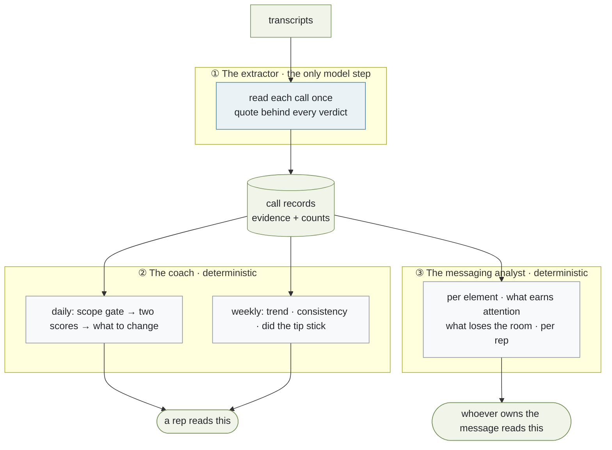
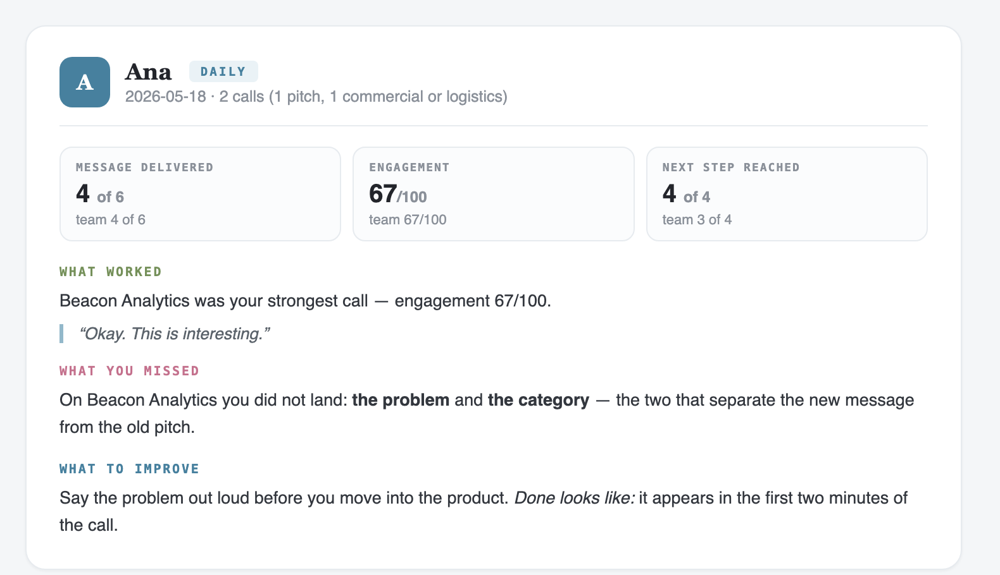
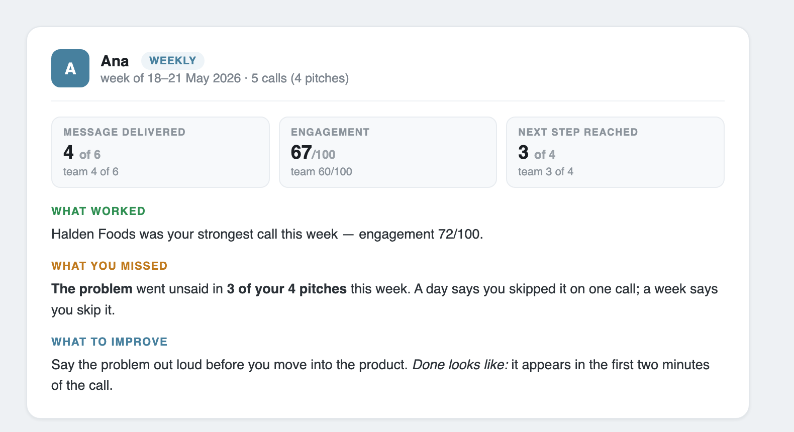
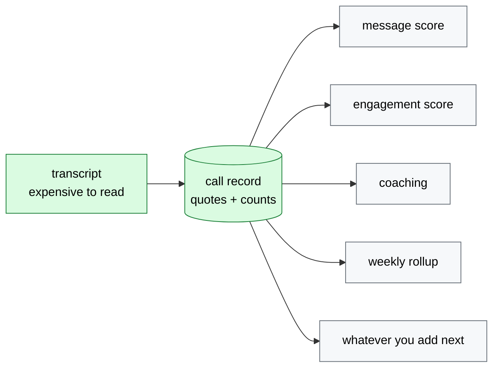

# Evidence-scored call coaching

  

> A template for **grading conversations against a rubric you can defend**: read each transcript once, score it only where the rubric applies, require a verbatim quote for every point given *or withheld*, and refuse to state a verdict until there are enough calls to justify one.


The example in this repo is a sales team checking whether reps actually deliver a new positioning message. The pattern works anywhere a human judgment becomes a number someone is measured on — support-ticket QA, interview scorecards, teaching observations, compliance call review. The failure modes are the same everywhere: scoring things the rubric was never meant to cover, awarding points with no evidence, and calling a trend off four data points.

---

## What it does

Point it at a folder of call transcripts. It gives you, per call:

| | |
|---|---|
| **How much of your message was delivered** | six things you decided to say, counted — and only on calls where a pitch belonged |
| **How the buyer responded** | next step reached, situations they described, excitement, real back-and-forth |
| **A coaching message per rep** | what worked, what they missed, one thing to change — every claim quoting the call |

---

## The agents

Three roles. Only the first is a model; the other two are the *analyst* and the *coach*, and in this repo they are deterministic Python — see the note below, because that is a deliberate difference from the system this came from.

| | agent | runs | reads | writes |
|:-:|:--|:--|:--|:--|
| ① | **The extractor** — reads the call, produces evidence | per call, daily | the transcript, the rubric | one `call_record.json`: every verdict with the quote behind it |
| ② | **The coach** — tells each rep what to change | daily *and* weekly | call records for that window | `coaching/<date>_<rep>.md`, `weekly/coaching-<rep>.md` |
| ③ | **The messaging analyst** — is the message working at all | weekly | every call record | `weekly/messaging-analysis.md` |

**The coach** writes two documents with the same shape but different claims. The daily one says *you skipped it on this call*; the weekly one says *you skip it* — and adds the three things a day cannot know: a trend against the rep's own previous week, the consistency spread across their pitches, and whether the last tip was actually adopted.

**The messaging analyst** never names a rep in judgement — it reports per rep so a reader can tell a coaching problem from a messaging problem, but its subject is the message. A gap that sits with one rep is fixed by coaching; the same gap across everyone is fixed by rewriting the pitch. Different problems, different owners.

### Why only one of them is a model here

In the system this pattern came from, ② and ③ are separate LLM agents on a weekly schedule. In this repo they are plain Python, on purpose:

- **What to say is chosen by rules, not by a model.** A model picking which weakness to raise drifts toward whatever is most narratable, varies week to week on identical evidence, and cannot be unit-tested. Deterministic selection means the same calls always produce the same coaching, and a rep asking *"why this one?"* gets an answer instead of a shrug.
- **The model does the part only a model can do** — reading unstructured speech and pointing at the sentence that proves each verdict. That is ①, and it is the whole reason an LLM is here at all.
- **The seam is open if you disagree.** A phrasing pass over already-selected content is a reasonable addition, and `callscore/extractors/base.py` is the only place a model plugs in. What should not move into a model is the *selection* — see Decision 9.



---

## Quickstart

No install, no API key, no network:

```bash
git clone https://github.com/barbararomeira/evidence-scored-call-coaching
cd evidence-scored-call-coaching
python3 run_day.py --mock
```

You get this, over six invented calls from three reps:

| call | rep | type | message delivered | framing pair | engagement | echo |
|:--|:--|:--|:-:|:-:|:-:|:-:|
| c-0412 | Ana | discovery | **4** of 6 | ✗ | 67 / 100 | — |
| c-0413 | Ana | pricing | *not a pitch* | — | 67 / 100 | — |
| c-0414 | Ben | demo | **6** of 6 | ✓ | 93 / 100 | ✓ |
| c-0415 | Ben | scheduling | *not a pitch* | — | 26 / 100 | — |
| c-0416 | Chloe | intro | **1** of 6 | ✗ | 35 / 100 | — |
| c-0417 | Chloe | discovery | **4** of 6 | ✓ | 60 / 100 | — |

*Message delivered* counts how many of your six message elements the rep actually said, out of the number that call had room for. *Framing pair* is whether the two that matter most — the problem and the category — landed **together**. *Engagement* is what the buyer did, scored out of 100.

> **Scored for message:** 4 of 6 calls — `c-0413` and `c-0415` were never pitches
> **Framing pair landed:** 2 of 4 pitches · `n=4 — not enough data yet`
> **Echo:** 1 of 6, recorded and never scored
> **Every scored point carries a verbatim quote found in its own transcript.**

Three things in that table are the whole design:

1. **Two calls have no score at all**, not a zero. A pricing negotiation isn't a bad pitch — it isn't a pitch.
2. **One number refuses to be interpreted.** It prints, then says the sample is too small to mean anything.
3. **Ana looks fine and isn't.** Four of six elements delivered, twice — but the framing pair never lands. A coverage score alone calls that a good week.

### The three things it writes

**① Daily coaching** — what one rep gets the morning after their calls:



**② Weekly coaching** — same shape, but carrying the four things a day structurally cannot: a trend against the rep's *own* previous week, consistency (the spread across their pitches and which call pulls the bottom), follow-through on the last tip, and the open tips register with a status derived from later calls — never self-reported:



**③ Messaging analysis** — a different document for a different reader. About the message, never about a person:


All five outputs are committed as text in **[`examples/`](examples/)**; the cards above are rendered from the same run by [`docs/make_visuals.py`](docs/make_visuals.py), so they cannot drift from what the code does.

`--mock` swaps **only** the extraction step, replaying pre-recorded call records from `fixtures/`. Every gate, score, coaching selection and rollup after that is real code executing. Want to read before running? [`examples/`](examples/) has the committed output.

---

## Finding your way around

| If you want to… | Go here |
|---|---|
| see what it produces, without cloning | [`examples/`](examples/) |
| change what gets scored | [`rubric/`](rubric/) — four files, the only ones you edit |
| understand why it works this way | [`DECISIONS.md`](DECISIONS.md) — 10 entries, chose / considered / why |
| see the calls it runs on | [`fixtures/`](fixtures/) — invented transcripts and the story they tell |
| plug in your own model | [`callscore/extractors/base.py`](callscore/extractors/base.py) — one method |
| read the scoring itself | [`callscore/score_message.py`](callscore/score_message.py) · [`score_engagement.py`](callscore/score_engagement.py) · [`scope.py`](callscore/scope.py) |

---

## What makes this worth copying

**1. Extract once, analyse many times.** The transcript is the expensive input and the only non-deterministic step. One pass produces one call record; the message score, the engagement score and the coaching all read *that*, never the transcript again. Cost becomes linear in calls rather than calls × metrics — and, more importantly, the numbers can't contradict each other. Two passes over the same call can disagree about whether the rep named the category, and then a coaching message contradicts the dashboard.

**2. Refusing to score is a feature.** A pricing negotiation is not a bad pitch; it isn't a pitch. Calls outside the rubric's scope get `message: None` and a printed reason, never a zero. A score that is always available and sometimes meaningless is worse than one that admits when the question doesn't apply.

**3. Evidence in both directions.** Every verdict carries a quote, and `run_day.py` checks that the quote actually appears in that transcript. `absent` needs evidence too — the passage where the element should have been. One-directional evidence produces a scorer that is rigorous about praise and casual about blame, which is backwards for something a person is measured on.

**4. Print n, and shut up below five.** Thin aggregates still show their number, but the interpretation is replaced by `not enough data yet`. Hiding them teaches people the report is unreliable; confidence intervals are the right statistics and the wrong interface.

**5. Two scores, never blended.** *Message delivered* is about whether the rep said what the company decided to say. *Engagement* is about whether the buyer leaned in — partly the rep, largely the account. Averaging them lets a great meeting with an off-message pitch hide inside a mediocre number, which is the one thing this exists to detect.

Full reasoning, including what was considered and rejected, in [`DECISIONS.md`](DECISIONS.md).

---

## Why "extract once" is the whole architecture



Adding a new question about your calls costs one consumer of the record, not another pass over the transcripts. In the system this pattern came from, the calls were already being read every morning for a completely different purpose; the second question cost one extra extraction step, not a new pipeline.

## What is scored, what is refused, what is only recorded

| | | |
|---|---|---|
| **Message delivered** | the problem · the category | reported *together* as the **framing pair** |
| | see what is happening · be told, not go looking | |
| | what no other system can do · value that lasts | |
| **Engagement** | next step reached | 35 |
| | their own situations | 25 |
| | excitement | 20 |
| | back-and-forth | 20 |
| **Recorded, never scored** | echo — the buyer restating your framing in their own words | the best signal there is, and the one that dies if you count it |
| **Refused a score** | pricing · scheduling · implementation · scoping | no pitch was delivered, so there is nothing to grade |

The framing pair is reported separately from the coverage score because a call can deliver four promises cleanly while the frame around them is still the old pitch — and counting elements cannot see that. Echo stays unscored on purpose: the moment it earns points, people start fishing for it.

---

## Use it on your own calls

**1. Rewrite the rubric.** [`rubric/`](rubric/) is the only place you need to touch: `positioning.md` (prose, for the model), `message_rubric.json` (the elements), `engagement_rubric.json` (the weights — a test enforces they sum to 100), `scope.json` (which call types the message rubric applies to, and why). Nothing about the domain is hardcoded in Python.

**2. Point it at your transcripts.** The input contract is a folder of markdown files with front matter (`call_id`, `date`, `rep`, `call_type`, `duration_min`) and `REP:` / `PROSPECT:` turns. Any notetaker that exports text can feed it.

```bash
python3 run_day.py --transcripts ./my_calls --extractor claude_cli
```

**3. Bring your own model.** `callscore/extractors/base.py` defines one method. `mock` ships working; `claude_api`, `claude_cli`, `codex_cli` and `ollama` are named stubs that raise with instructions — roughly 40 lines each, and deliberately not written for you, so nobody inherits a vendor choice they didn't make.

---

## Tests

**13 tests** covering: the scope gate refusing rather than zeroing · not-applicable elements leaving the denominator while absent ones stay in · the framing pair being independent of the coverage score · engagement weights summing to 100 · echo declared but never scored · the short-call rule refusing to extrapolate a nine-minute call · excitement capped · quotes verified against their own transcript · absent verdicts requiring evidence too.

```bash
python3 -m pytest tests -q
```

## Not built, on purpose

CRM connectors · audio and diarisation · a web UI · a database · delivery and scheduling · running one installation for several teams at once. Each is a real piece of work and none of it is the interesting part. This is one team, one rubric, files on disk.

## License

MIT.
