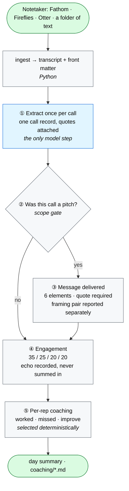
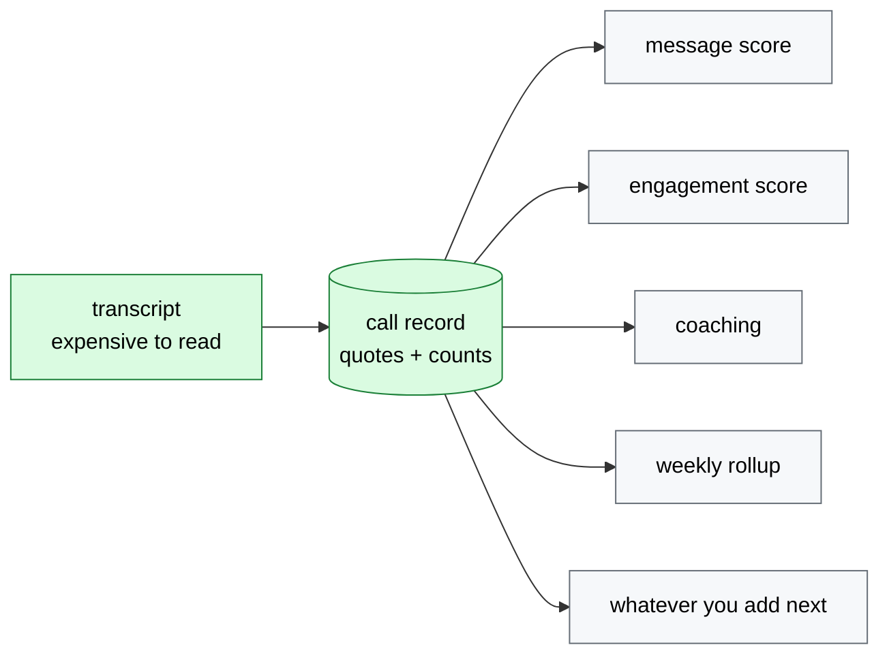
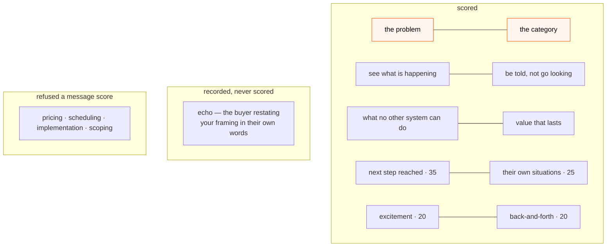

# Evidence-scored call coaching

  

> A template for **grading conversations against a rubric you can defend**: read each transcript once, score it only where the rubric applies, require a verbatim quote for every point given *or withheld*, and refuse to state a verdict until there are enough calls to justify one.

The example in this repo is a sales team checking whether reps actually deliver a new positioning message. The pattern works anywhere a human judgment becomes a number someone is measured on — support-ticket QA, interview scorecards, teaching observations, compliance call review. The failure modes are the same everywhere: scoring things the rubric was never meant to cover, awarding points with no evidence, and calling a trend off four data points.

---

## Quickstart

No install, no API key, no network:

```bash
git clone https://github.com/barbararomeira/evidence-scored-call-coaching
cd evidence-scored-call-coaching
python3 run_day.py --mock
```

```
call      rep    type           message       framing engagement  echo
──────────────────────────────────────────────────────────────────────
c-0412    R-02   discovery       67 (4/6)     no              67  no
c-0413    R-02   pricing        — out of scope —               67  no
c-0414    R-05   demo           100 (6/6)     yes             93  yes
c-0415    R-05   scheduling     — out of scope —               26  no
c-0416    R-07   intro           17 (1/6)     no              35  no
c-0417    R-07   discovery       67 (4/6)     yes             60  no

  Scored for message:  4 of 6 calls
    out of scope — c-0413 (pricing): Commercial negotiation. Nobody restates the category while discussing price.
    out of scope — c-0415 (scheduling): Logistics. There is no pitch to deliver.
  Framing pair landed: 2 of 4 pitches   n=4 — not enough data yet
  Echo (recorded, never scored): 1 of 6
  Every scored point carries a verbatim quote found in its own transcript.
```

That output contains the whole design. Two calls get **no message score at all** rather than a zero. One aggregate prints its number and then refuses to interpret it. And nothing was scored that isn't backed by a quote found in the call it came from.

`--mock` swaps **only** the extraction step, replaying the pre-recorded call records in `fixtures/`. Every gate, score, coaching selection and rollup after that is real code executing. Prefer to read before running? [`examples/`](examples/) has the committed output, including two coaching messages.

---

## What makes this worth copying

**1. Extract once, analyse many times.** The transcript is the expensive input and the only non-deterministic step. One pass produces one call record; the message score, the engagement score and the coaching all read *that*, never the transcript again. Cost becomes linear in calls rather than calls × metrics — and, more importantly, the numbers can't contradict each other. Two passes over the same call can disagree about whether the rep named the category, and then a coaching message contradicts the dashboard.

**2. Refusing to score is a feature.** A pricing negotiation is not a bad pitch; it isn't a pitch. Calls outside the rubric's scope get `message: None` and a printed reason, never a zero. A score that is always available and sometimes meaningless is worse than one that admits when the question doesn't apply.

**3. Evidence in both directions.** Every verdict carries a quote, and `run_day.py` checks that the quote actually appears in that transcript. `absent` needs evidence too — the passage where the element should have been. One-directional evidence produces a scorer that is rigorous about praise and casual about blame, which is backwards for something a person is measured on.

**4. Print n, and shut up below five.** Thin aggregates still show their number, but the interpretation is replaced by `not enough data yet`. Hiding them teaches people the report is unreliable; confidence intervals are the right statistics and the wrong interface.

**5. Two scores, never blended.** *Message delivered* is about whether the rep said what the company decided to say. *Engagement* is about whether the buyer leaned in — partly the rep, largely the account. Averaging them lets a great meeting with an off-message pitch hide inside a mediocre number, which is the one thing this exists to detect.

Full reasoning, including what was considered and rejected, in [`DECISIONS.md`](DECISIONS.md).

---

## How it fits together



Blue is the one step a model touches. Grey is deterministic Python. Green is what goes in and comes out.

### Why "extract once" is the whole architecture



Adding a new question about your calls costs one consumer of the record, not another pass over the transcripts. In the system this pattern came from, the calls were already being read every morning for a completely different purpose; the second question cost one extra extraction step, not a new pipeline.

### What is scored, what is refused, what is only recorded



The two orange elements are reported together as the **framing pair**, separately from the coverage score. That exists because of a real miss: a call can deliver four promises cleanly while the frame around them is still the old pitch, and a coverage score is structurally blind to it. Echo stays unscored on purpose — the moment it counts, people fish for it and the signal dies.

---

## Use it on your own calls

**1. Rewrite the rubric.** [`rubric/`](rubric/) is the only place you need to touch: `positioning.md` (prose, for the model), `message_rubric.json` (the elements), `engagement_rubric.json` (the weights — a test enforces they sum to 100), `scope.json` (which call types the message rubric applies to, and why). Nothing about the domain is hardcoded in Python.

**2. Point it at your transcripts.** The input contract is a folder of markdown files with front matter (`call_id`, `date`, `rep`, `call_type`, `duration_min`) and `REP:` / `PROSPECT:` turns. Any notetaker that exports text can feed it.

```bash
python3 run_day.py --transcripts ./my_calls --extractor claude_cli
```

**3. Bring your own model.** `callscore/extractors/base.py` defines one method. `mock` ships working; `claude_api`, `claude_cli`, `codex_cli` and `ollama` are named stubs that raise with instructions — roughly 40 lines each, and deliberately not written for you, so nobody inherits a vendor choice they didn't make.

---

## Tests

**13 tests** covering: the scope gate refusing rather than zeroing · not-applicable elements leaving the denominator while absent ones stay in · the framing pair being independent of the coverage score · engagement weights summing to 100 · echo declared but never scored · the short-call rule refusing to extrapolate a nine-minute call · excitement capped · quotes verified against their own transcript · absent verdicts requiring evidence too.

```bash
python3 -m pytest tests -q
```

## Repo map

| Path | Purpose |
|---|---|
| `rubric/` | The four files you edit to make this yours |
| `callscore/` | Scoring, gates, evidence checks, rendering — all deterministic |
| `callscore/extractors/` | The single seam where a model touches the system |
| `fixtures/` | Six synthetic calls and the story they tell |
| `examples/` | Committed output, readable before you clone |
| `tests/` | The claims above, pinned |

## Not built, on purpose

CRM connectors · audio and diarisation · a web UI · a database · delivery and scheduling · running one installation for several teams at once. Each is a real piece of work and none of it is the interesting part. This is one team, one rubric, files on disk.

## License

MIT.
